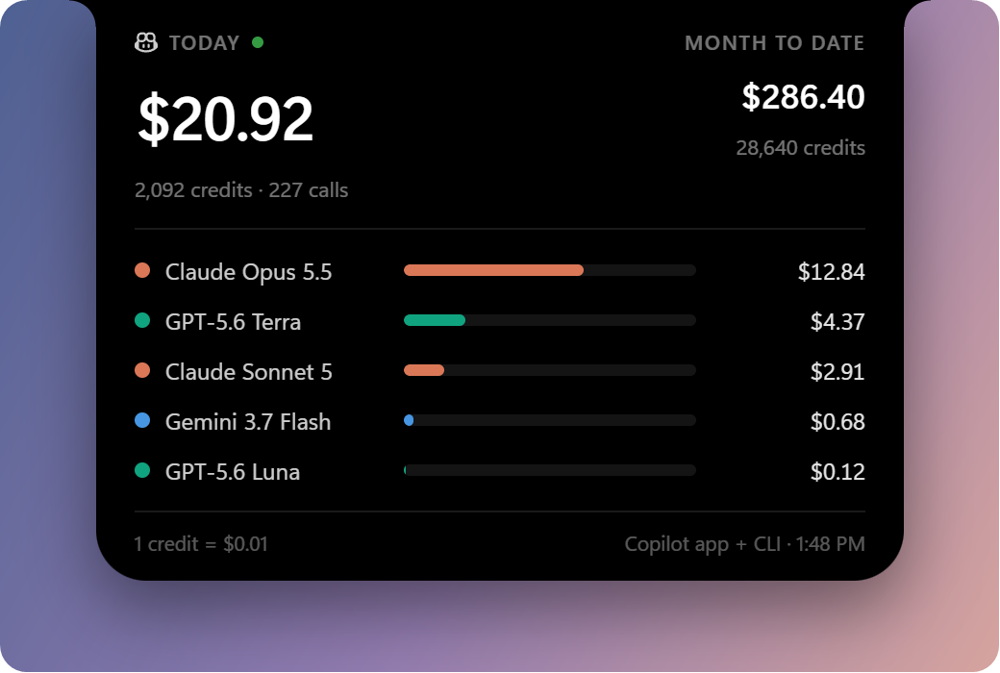

# Spend Notch

[](https://github.com/anjulalk/spendnotch/actions/workflows/ci.yml)
[](LICENSE)

A MacBook-style notch for Windows that shows what GitHub Copilot has cost you **today**, in US dollars.

<p align="center">
  
  <br><br>
  
  <br>
  <sub>Screenshots use demo data.</sub>
</p>

- Sits at the top center of your primary screen, always on top and click-through.
- Hover to expand it: per-model breakdown, AI credits, calls and month-to-date spend.
- Updates live as you use Copilot. The green dot pulses while requests are flowing.
- Lives in the tray: show/hide, start with Windows, quit.

## Install

Download `Spend Notch Setup <version>.exe` from [Releases](https://github.com/anjulalk/spendnotch/releases) and run it. The installer isn't code-signed, so Windows SmartScreen may ask you to confirm.

## How it measures

Copilot bills in AI credits: **1 AI credit = $0.01 USD**, priced per token for each model.

Spend Notch reads the local Copilot session store (`%USERPROFILE%\.copilot\session-store.db`) in read-only mode. The Copilot app and Copilot CLI record every model call there with its exact cost in nano AI credits (`total_nano_aiu`):

```
USD = total_nano_aiu / 1e9 × 0.01
```

- **Today** starts at local midnight. **Month to date** starts at local midnight on the 1st.
- Only Copilot app and Copilot CLI usage is counted. Usage from VS Code, github.com, cloud agent or code review isn't in the local store.
- Set `SPEND_NOTCH_DB` to read a different store.

## Develop

```
npm install
npm run dev     # Vite + Electron with hot reload
npm run build   # typecheck + production build
npm start       # run the production build
npm run dist    # Windows installer in release/
```

Stack: Electron 44, Vite 8, React 19, TypeScript 7, Tailwind CSS 4, Motion and NumberFlow. It uses Node's built-in `node:sqlite`, so there are no native modules. See [AGENTS.md](AGENTS.md) for architecture notes and conventions.

## Release

Bump `version` in `package.json`, then push a matching tag:

```
git tag v0.1.0
git push origin v0.1.0
```

The Release workflow builds the installer on Windows and publishes it as a GitHub release.

## License

[MIT](LICENSE)
